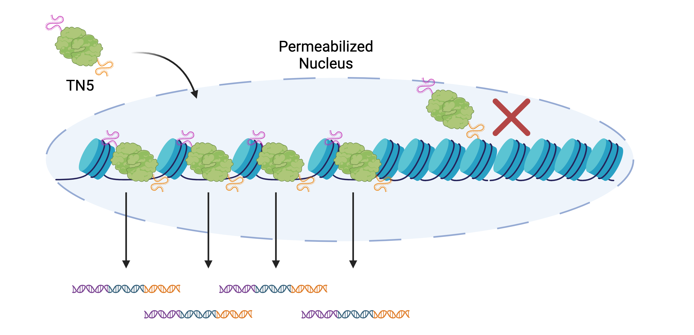

# ATAC-seq

The goal of ATAC-seq is to evaluate the level of accessibility throughout the genome in a population of cells. Accessible chromatin is associated with actively transcribed regions of the genome and sites bound by transcription factors. ATAC-seq relies on a transposase enzyme called Tn5 to selectively excise accessible regions of chromatin within a cell's nucleus. This excised chromatin is then used to form a sequencing library in which read peaks will denote regions of high accessibility.



Created with BioRender.com

## Analytical Workflow
If starting with raw fastq files, start at the beginning. If starting with different files, start with the appropriate step. I have added the file extensions to each step to give you an idea of where you might be in the process.

In bash:
* Trimming and Quality control
* Mapping (.fastq &rarr; .sam/.bam files)
* Peak Calling (.bam file &rarr; .bed files)
* Intersecting .bed files
* Footprinting
* Gene Calling

In R:
* Plotting

### Trimming and Quality control

The goal of this step is to assess the quality of your samples and to remove the adapter sequences from the sequenced reads. The adapters are added during the library preparation and are necessary for the hybridization of the sequence fragments to the sequencing chip, but are not actual sequences you want to map or evaluate.

For quality control I like to use the *Trim Galore* (https://github.com/FelixKrueger/TrimGalore?tab=readme-ov-file) wrapper of cutadapt the and fastqc package from babraham. (https://github.com/marcelm/cutadapt).

Example usage:
``` bash
trim_galore --fastqc --fastqc_args "--outdir ${DIR}/fastQC" --paired --retain_unpaired --output_dir ${DIR}/trimmed_reads ${INPUT_R1} ${INPUT_R2}
```

The output of this code will create a .html report for the quality control and a trimmed fastq file with the adapters removed.

### Mapping
The goal of the mapping step is to annotate the genomic coordinates to the gene fragments.

For the mapping of ATAC-seq reads I have used:

- *BBMap Package:* (https://jgi.doe.gov/data-and-tools/software-tools/bbtools/bb-tools-user-guide/bbmap-guide/)
   - Remove singletons and sort trimmed FASTQ files using bbmap repair
- *BWA* (BWA is currently available on ACCRE as a module)
  - module commands:
``` bash
module load GCC/6.4.0-2.28
module load BWA/0.7.17
```
  - Map using BWA
- *SamTools* (SamTools is currently available on ACCRE as a module)
  - module commands:
``` bash
module load GCC/6.4.0-2.28
module load SAMtools/1.6
```
  - Filter for Map quality score of 40
  - Filter out mitochondrial DNA
  - Remove blacklisted regions

Generic Mapping Code:

``` bash
# bbmap repair, removes singletons and sorts .fq files
repair.sh in1=${base}_trimmed.fq in2=${base}_trimmed.fq \
  out1=${base}_Mate1_repaired.fq out2=${base}_Mate2_repaired.fq \
  outs=${base}_singletons.fq repair

# Map to genome using BWA
## CPU denotes the number of cores for multithreading
## REF is the path to the index genome fasta

bwa mem -t $CPU $REF ${IN_DIR}/${base}_Mate1_repaired.fq ${IN_DIR}/${base}_Mate2_repaired.fq| \
samtools view -@ $CPU -Sb > ${OUT_DIR}/${base}_bwa.bam
```

Filtering code:

``` bash
# Filter out low quality reads and reads mapped to black list sites and mitochondria
samtools view -@ $CPU -S -b -q 40 ${base}_bwa.bam > ${base}_bwa_mapq40.bam
samtools sort -@ $CPU -o ${base}_bwa_mapq40_sorted.bam ${base}_bwa_mapq40.bam
samtools index -b ${base}_bwa_mapq40_sorted.bam ${base}_bwa_mapq40_sorted.bam.bai

samtools view -@ $CPU -b ${base}_bwa_mapq40_sorted.bam chr1 chr2 chr3 chr4 chr5 chr6 \
 chr7 chr8 chr9 chr10 chr11 chr12 chr13 chr14 chr15 chr16 chr17 chr18 chr19 chr20 chr21 \
 chr22 chrX chrY > \
 ${base}_bwa_no_chrM.bam
samtools index -b ${base}_bwa_no_chrM.bam ${base}_bwa_no_chrM.bam.bai

samtools view -@ $CPU -b -L /path/to/hg38.blacklist.bed \
  -U ${base}_bwa_filtered.unsorted.bam ${base}_bwa_no_chrM.bam > ${base}_bwa_blacklisted.bam
samtools sort -@ $CPU ${base}_bwa_filtered.unsorted.bam > ${FILT_DIR}/${base}_bwa_filtered.bam
samtools index -b ${FILT_DIR}/${base}_bwa_filtered.bam ${FILT_DIR}/${base}.filtered.bam.bai
```

### Peak calling

The goal of peak calling is to determine genomic loci where there are an accumulation of mapped reads. These are the sites that we would be confident in calling "accessible"

For peak calling I use Genrich (https://github.com/jsh58/Genrich)

example code for peak calling:
``` bash
Genrich -t ${IN_DIR}/${base}.n-sorted.bam \
          -o ${OUT_DIR}/${base}_filtered_0.05.narrowPeak \
          -f ${OUT_DIR}/${base}_filtered_0.05.pqvalues.bed \
          -r -p 0.05 -v -j -e chrX,chrY \ # this removes the sex chromosomes, which you may want to do

```

The output of this code are the narrowPeak and bed files. These files are contain the regions we are calling significant. The narrowPeak file contains more metadata about the called peaks, but the bed file contains the relevant information.

general format of a bed file:

| Chromosome | Start | End  | Other metadata...
|----------|------------|------------| ------------|
| Chr1   | bp # | bp #|...|
| Chr1    | bp # | bp #|...|
| Chr1    | bp # | bp #|...|

### Peak Intersecting

Peak intersecting is the process by which you identify the overlap of two different peaks. This is a key process in ATAC-seq analysis since you often want to identify the regions of accessiblity that are common between samples, or unique to samples.

Often times when accessing an ATAC-seq dataset, you will start with .bed or narrowPeak files. This means you can skip the previous steps.

All of these processes are largely handled by bedTools (https://bedtools.readthedocs.io/en/latest/index.html)

I won't go into too much detail as bedTools is very well documented and the types of processes are going to be very dependent on your purposes.

example code:
``` bash
bedtools intersect -a path/to/ETV5_MA0765.2_GSM3593802_HCT116_R1_Omni-ATAC_bound.bed \
    -b path/to/ETV5_MA0765.2_GSM3593803_HCT116_R2_Omni-ATAC_bound.bed \
    > path/to/ETV5_bound_intersect.bed
```


### Footprinting

Footprinting is a process by which you can identify potential binding sites of proteins in accessible regions of chromatin. This works by looking for slight dips in accessibility within accessible regions to infer where protein binding may be taking place.

As a preparation step  for this process, I use deeptools (https://deeptools.readthedocs.io/en/develop/content/tools/bamCoverage.html)to convert bam files to bigwig files (if I don't already have access to bigwig files.)

deeptools bigwig conversion:
```bash
bamCoverage -b reads.bam -o coverage.bw
```
For the actual Footprinting I use TOBIAS (https://github.com/loosolab/TOBIAS)

example code:
``` bash
#This first step identifies footprint sties within accessible regions
TOBIAS FootprintScores --signal ${base}.bw \ #input file
  --regions ../clean_cistromeATAC.txt \ # here you can specify called peaks to limit the parameters of the footprint search
  --output ${base}_footprints.bw \
  --cores 4

#This step searches the footprint file for motifs to identify potential TF binding partners
#I use the JASPAR database file to identify motif sequences for transcription factors
TOBIAS BINDetect --motifs /path/to/JASPARfile/JASPAR2020_CORE_vertebrates_non-redundant_pfms_jaspar.txt \
  --signals ${base}_footprints.bw \
  --genome /path/to/human_genome/hg19.fa \
  --peaks ../clean_cistromeATAC.txt \
  --outdir ./motifs_${base} \
  --cond_names ${base} \
  --cores 4
```
This code will output a directory of results for each of the transcription factors within your chosen motif file. There will be individual bed files for each transcription factor.

### Gene Calling

For nearest neighbor gene annotation, GREAT (http://great.stanford.edu/public/html/) is a good tool. The input for this tool is a bed file. The output is genes near to the given peaks. There is an R package version of this tool, rGREAT (https://github.com/jokergoo/rGREAT). Results do differ between the web app and the R package. This list of genes can be used for your choice of gene ontology to get an idea of what gene pathways may be affected or regulated by the accessible chromatin.


## Plotting
A combined plotting file will be included in a separate directory
