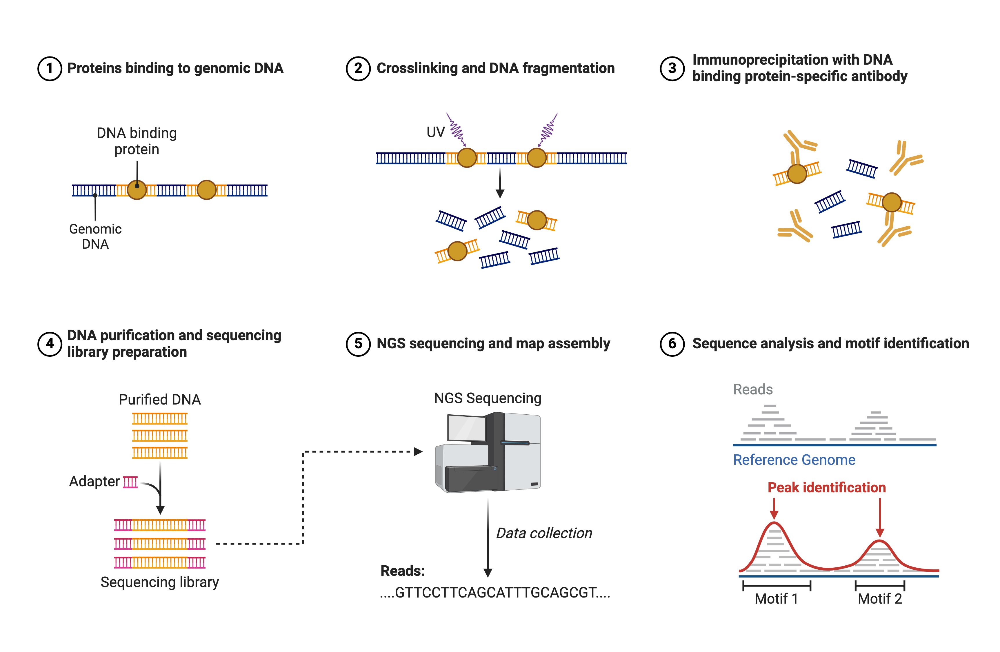

# ChIP-seq

The goal of ChIP-seq is to evaluate the location and degree of binding of a single DNA-bound protein throughout the genome in a population of cells. ChIP-seq (or chromatin immunoprecipitation) uses antibodies to bind to fragmented chromatin and "pull down" DNA bound fragments. This excised chromatin is then used to form a sequencing library in which read peaks will denote regions bound to our protein of interest.

## Analytical Workflow
If starting with raw fastq files, start at the beginning. If starting with different files, start with the appropriate step. I have added the file extensions to each step to give you an idea of where you might be in the process.

In bash:
* Trimming and Quality control
* Mapping (.fastq &rarr; .sam/.bam files)
* Peak Calling (.bam file &rarr; .bed files)
* Intersecting .bed files
* Gene Calling

In R:
* ChIPseeker package
* Plotting

### Trimming and Quality control

***These processes are largely the same in principle to ATAC-seq.***

### Mapping

***These processes are largely the same in principle to ATAC-seq.***

### Peak Calling

***These processes are largely the same in principle to ATAC-seq.***

### Peak Intersecting

***These processes are largely the same in principle to ATAC-seq.***

### Gene Calling

***These processes are largely the same in principle to ATAC-seq.***

### ChIPseeker Package

(https://www.bioconductor.org/packages/devel/bioc/html/ChIPseeker.html#since)

Can annotate genomic location relative to gene transcripts

inputting a bed file you can create venn diagrams or bar charts representing the relative proportion of sequences in different relationships to transcripts.
