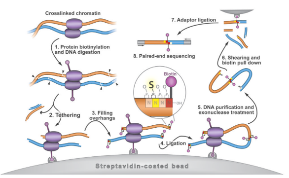

# HiC

The goal of HiC is to evaluate the interaction and degree of interaction between distal elements of chromatin. HiC is a "high-throughput" version of 3C, which stands for chromatin conformation capture. This assay uses a process of proximity ligation in which interacting elements of chromatin are crosslinked together, followed by fragmentation and religation. This process creates a library of chimeric fragments in which each half of the fragment maps to a different interacting element.

Image credit: Kalhor et al. *Nature Biotechnology*. 2011 (PMID: 22198700)

## Analytical Workflow
If starting with raw fastq files, start at the beginning. If starting with different files, start with the appropriate step. I have added the file extensions to each step to give you an idea of where you might be in the process.

In bash:
* Trimming and Quality control
* Mapping (.fastq &rarr; .sam/.bam files)
* Loop Calling (.bam file &rarr; .bedpe files)

In R:
* Plotting

### Trimming and Quality control

***These processes are largely the same in principle to ATAC-seq.***

See the ATAC-seq readme for the above tutorials.

### Mapping

Mapping is quite different for HiC assays as it is important to remember that each end of a read ideally maps to a different locus within the genome.
