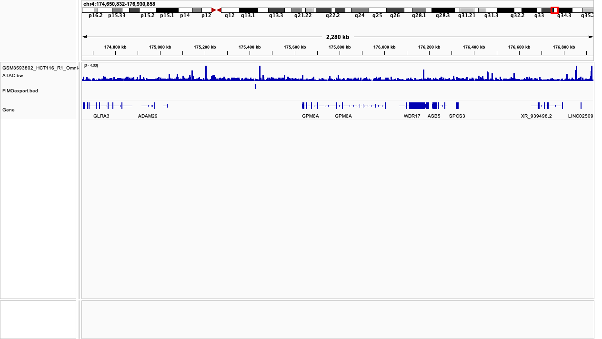

# Plotting Functional Genomic Data

There are two tools that I like to use when plotting functional genomic data.


## IGV

IGV is fast and easy to use. There is both a desktop app (https://igv.org/doc/desktop/) and an R package (https://www.bioconductor.org/packages/release/bioc/html/igvR.html) that can be implemented. Using IGV you can quickly move between loci and zoom in and out. to find the window you want to visualize before exporting an image.

The primary weakness of this program is that the images are not as visually appealing and are not easily customized.

IGV also cannot parse bedpe files for HiC data.



This image shows the tracks from the files in the plotting example folder.

## plotgardener

plotgardener is a great R package for making visually appealing track images (https://phanstiellab.github.io/plotgardener/). The primary weakness of this package is how coding intensive it is and how long it can take an image to load for tinkering and adjusting.

Below is an example of code for visualizing the example files (./PlottingExample) followed by the generated image.

### Loading in the files

``` r

HiCLoops <- read.delim(sep = " ", col.names = c("chrom1", "start1", "end1", "chrom2", "start2", "end2", "strand", "counts"),file = "./GSM3930278_BRD3179N.filt.intra.loop_counts.bedpe")


BedExample <- read_tsv(file = "./FIMOexport.bed", col_names = c("chrom", "start", "end"))

Bw_example <- rtracklayer::import.bw(con = "./GSM3593802_HCT116_R1_Omni-ATAC.bw")

```

### Plotting code

``` r

#Set the size of the page
pageCreate(width = 6, height = 6, default.units = "inches")

#Set the coordinates for the viewing window
coords <- pgParams(chrom = "chr4", chromstart = 174650832, chromend = 176930858,
                   assembly = "hg38",x = 3, width = 4,
                   just = c("center", "center"), default.units = "inches")

#Add gene labels
genes_a <- plotGenes(params = coords, stroke = 3, fontsize = 14,
                        y = 1.1, height = 1)

ExampleBedTrack <- plotRanges(BedExample, params = coords, y = 2, height =1,
                       fill = "purple")

ExampleBwTrack <- plotSignal(Bw_example, params = coords, y = 3, height =1,
                      linecolor = "darkgreen", fill = "darkgreen")

ExampleHiCTrack <- plotgardener::plotPairsArches(HiCLoops, params = coords, height = 1, fill = "#27ae60", y = 5, archHeight = "counts")

```


