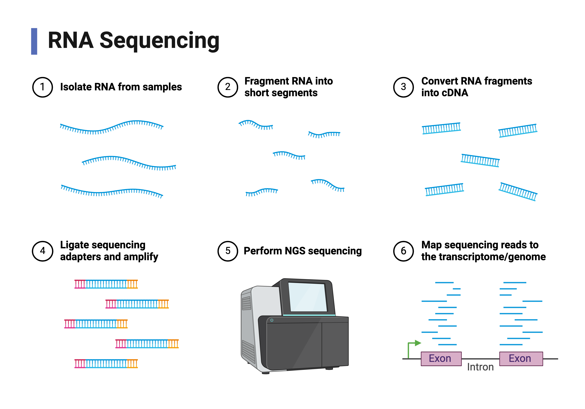

# RNA-seq

The goal of RNA-seq is to evaluate the level of expression of genes within a population of cells. This guide will focus primarily on "bulk" RNA sequencing. An important distinction in "bulk" RNA-seq in contrast with single cell RNA-seq is that bulk sequencing will take a collective snapshot of gene expression from the cell types represented in the assayed sample. If a bulk RNA-seq sample is taken from a tissue or tumor sample, it is important to note that the measured gene expression values will be representative of gene expression across the represented cell types and affected by the relative proportions of those cell types.



Biorender Template by Eunice Huang

## Technical considerations

There are a number of technical considerations at the sample preparation stage that are important to keep in mind when collecting RNA-sequencing data from other sources and databases. It is general practice during sample preparation to deplete samples of rRNA molecules. rRNA molecules are the most plentiful RNA molecules in a cell, but are often not the focus of many RNA-seq studies.

Another technical consideration is poly-A tail enrichment. Some assays will enrich the sample for molecules with poly-A tails. This will enrich the sequencing library for mRNA molecules and will not accurately evaluate non-coding RNA molecules.

Depending on the purposes of your study you may need to know this information.

## Analytical Workflow
If starting with raw fastq files, start at the beginning. If starting with different files, start with the appropriate step. I have added the file extensions to each step to give you an idea of where you might be in the process.

In bash:
* Trimming and Quality control
* Mapping (.fastq &rarr; .sam/.bam files)
* Counting (.bam file &rarr; counts matrix)

In R:
* Differential Expression Analysis
* Plotting

### Trimming and Quality control

The goal of this step is to assess the quality of your samples and to remove the adapter sequences from the sequenced reads. The adapters are added during the library preparation and are necessary for the hybridization of the sequence fragments to the sequencing chip, but are not actual sequences you want to map or evaluate.

For quality control I like to use the *Trim Galore* (https://github.com/FelixKrueger/TrimGalore?tab=readme-ov-file) wrapper of cutadapt the and fastqc package from babraham. (https://github.com/marcelm/cutadapt).

Example usage:
``` bash
trim_galore --fastqc --fastqc_args "--outdir ${DIR}/fastQC" --paired --retain_unpaired --output_dir ${DIR}/trimmed_reads ${INPUT_R1} ${INPUT_R2}
```

The output of this code will create a .html report for the quality control and a trimmed fastq file with the adapters removed.

### Mapping

Mapping is unique for RNA-seq and requires a specific mapping program and genome file. It is important to pay attention when mapping RNA-seq reads since they will not map to a normal genome. This is because RNA molecules have been spliced and are missing intronic sequences. This will disrupt the mapping if you are trying to map RNA-seq reads using normal genomic mapping.

For RNA-seq mapping, I use the STAR aligner (https://github.com/alexdobin/STAR)

Example usage:
``` bash
STAR --runMode alignReads --runThreadN 8 --genomeDir ${INDEX} --readFilesCommand zcat \
--readFilesIn ${DIR}/trimmed_reads/${RUN}_R1_001_val_1.fq.gz ${DIR}/trimmed_reads/${RUN}_R2_001_val_2.fq.gz --outFileNamePrefix ${DIR}/mapped_reads/${filename}.sam
```
The genome for star can be created using the --runMode genomeGenerate utility within STAR. To run this function you will need a fasta file for your desired genome and genome annotation in .gtf format. These can be easily acquired from the UCSC genome browser.

Keep in mind that mapping is a computationally intensive process and will likely need to be run as a multithreaded slurm job.

The output of this stage is a .sam file, which is an uncompressed .bam file.

For the purposes of genomic track plotting, RNA-seq is generally plotted as a bigwig file histogram. To generate the bigwig file, deeptools (https://deeptools.readthedocs.io/en/develop/content/tools/bamCoverage.html) can be used to convert bam files to bigwig files (if I don't already have access to bigwig files.)

### Counting

This step is where mapped reads are counted to different gene transcripts. For example, a read that maps to exon 1 of "gene A" and another read that maps to exon 2 of "gene A" will lead to a count of 2 reads for "gene A" in that sample. For this step I like to use the featureCounts function of the Subread package (https://subread.sourceforge.net/featureCounts.html).

Example usage:

``` bash
featureCounts -F GTF -a /gencode.v32.annotation.gtf -G /data/hg38_genome/hg38.fa -o ${DIR}/feat_counts/featureCounts_all_samples_${cell_line}.txt -T 12 -O -t exon ${DIR}/filtered_reads/${cell_line}*.n-sorted.filtered.bam

#-a: specifies path to GTF
#-G (genome): provides the name of a FASTA-format file that contains the reference sequencesused in read mapping that produced the provided SAM/BAM files
#-o: specifies path to, and name of the text output (count matrix)
#-T: number of the threads; value should be between 1 and 32
#-O: allowMultiOverlap; reads will be allowed to be assigned to more than one matched meta-feature (or feature if -f is specified)
#-t: specifies feature type; 'exon' by default; a feature is an interval (range of positions)on one of the reference sequences; a meta-feature is a set of features that represents a biological construct of interest; features often correspond to exons and meta-features to genes
```

The output of this step is a counts matrix. For some datasets you access publicly, you may be able to start with the counts matrix, which will save you a lot of time.

General Format of Counts matrix:

|  | Sample 1 | Sample 2   | Sample 3   | ...|
|----------|------------|------------|------------|------------|
| Gene A   | # of reads | # of reads | # of reads | # of reads |
| Gene B   | # of reads | # of reads | # of reads | # of reads |
| Gene C   | # of reads | # of reads | # of reads | # of reads |
| ...   | # of reads | # of reads | # of reads | # of reads |

### Differential Expression Analysis

Generally in RNA-seq, you are comparing two groups of samples or technical replicates. The goal of differential expression analysis is to determine genes with divergent expression pattens between the two groups in the comparison.

The package I use for diferential sequencing analysis is DESeq2 (https://bioconductor.org/packages/release/bioc/html/DESeq2.html).

The following analyses will all be conducted in R. Recommended active packages below.

``` R
library(tidyverse) #ideal for general data cleaning
library(DESeq2) # package for Differential expression analyses
library(biomaRt) # package for converting gene IDs
library(org.Hs.eg.db) # package containing human transcripts,
                      #there are different versions for different genomes
```

#### Updating gene symbol names from Ensembl IDs

Just a generally helpful bit of code.

``` R
#add gene symbols
EnsemblVector <- rownames(CountsMatrix_df)
CountsMatrix_df$geneID <- EnsemblVector
mart <- useDataset("hsapiens_gene_ensembl", useMart("ensembl"))
genes <- EnsemblVector
G_list <- getBM(filters= "ensembl_gene_id",
                attributes= c("ensembl_gene_id","hgnc_symbol"),
                values=genes,mart= mart,
               useCache = FALSE)
CountsMatrix_df <- merge(CountsMatrix_df,
                               G_list,
                               by.x="geneID",
                               by.y="ensembl_gene_id")
```
